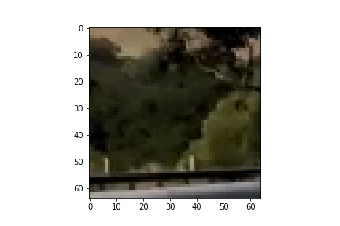
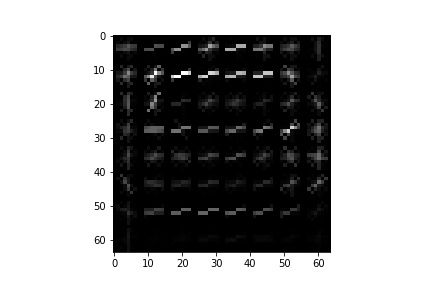
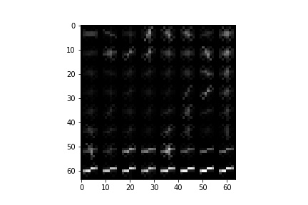
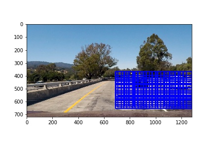
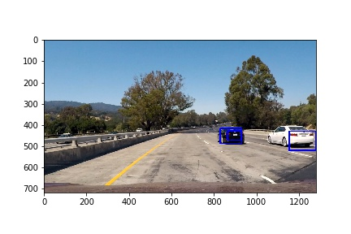
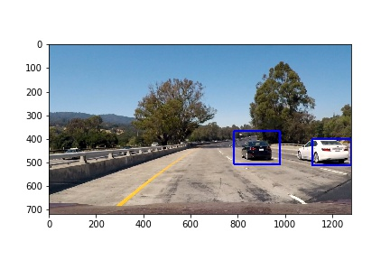

# Vehicle-Detection-using-SVM-and-CV
The python implementation for detecting cars in the periphery.The code uses support vector machines and computer vision techniques to achieve the aforementioned goals.

Following files are present in this directory:
project5.ipynb : Jupyter notebook containing the pipeline
project5.ipynb: html file of the notebook
output_images/: A folder to contain output images
output.mp4: output video file

# Pre-requisites to run the notebook: 
Make a folder called "image_bank"
Get the vehicle images from GTI and KTTi from 
[https://s3.amazonaws.com/udacity-sdc/Vehicle_Tracking/vehicles.zip](https://s3.amazonaws.com/udacity-sdc/Vehicle_Tracking/vehicles.zip)

Non-vehicle data is at
[https://s3.amazonaws.com/udacity-sdc/Vehicle_Tracking/non-vehicles.zip](https://s3.amazonaws.com/udacity-sdc/Vehicle_Tracking/non-vehicles.zip)

Unzip the vehicles  images in image_bank/vehicles/ 
Unzip the non vehicles  images in image_bank/non-vehicles/

#Output images are following

Sample image from vehicle dataset

Hogged image for the test vehicle image

Hogged image for the test non-vehicle image

Sliding windows showing the area to be search in the image

Cars detected in a  frame

Cars detected in a  frame via pipeline
